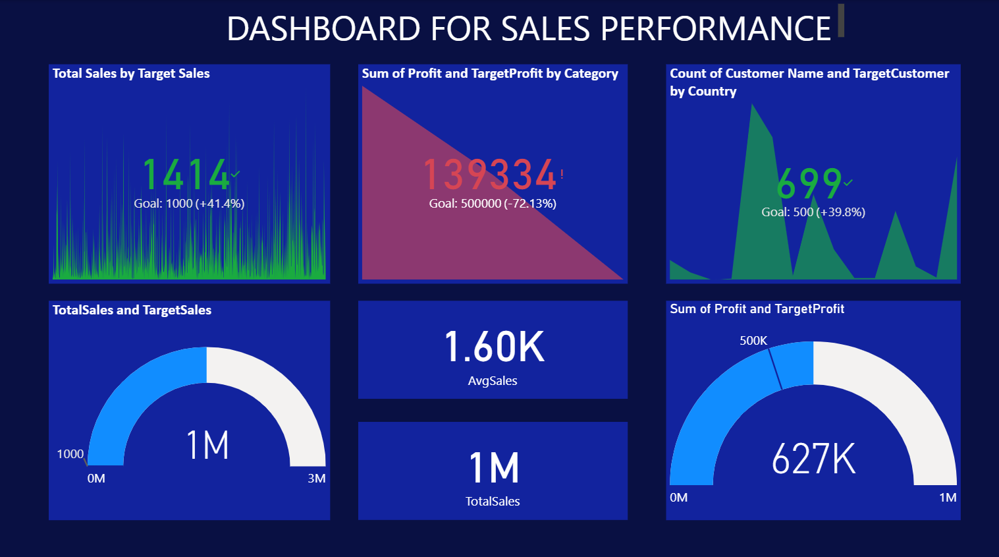
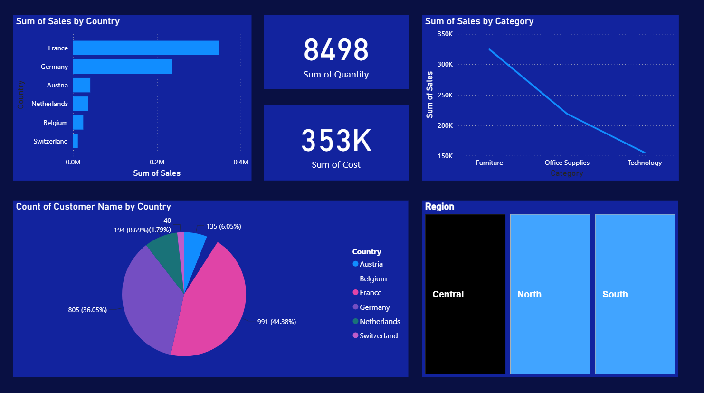

# Corporate Sales Performance Dashboard

## 📌 Project Overview
This interactive Power BI dashboard was developed to monitor business metrics, track performance targets, and analyze regional sales trends. By integrating and transforming raw transaction records, the dashboard offers actionable business intelligence regarding revenue streams, cost structures, and customer demographics across European markets.

### 🛠️ Tech Stack & Key Concepts
* **Data Source:** `Power BI Dataset (2).xlsx` (Cleaned relational sales data)
* **Tool:** Power BI Desktop
* **Core Techniques:** ETL Data Transformation, DAX Modeling, Interactive Regional Cross-filtering, Target KPI tracking.

---

## 📊 Dashboard Visuals

---

## 🔍 Dashboard Architecture & Layout

### Page 1: Executive KPI Summary
This view establishes key performance indicators (KPIs) and operational progress against strict business benchmarks.

*   **Total Sales vs. Target Sales:** Evaluates a calculated total volume of 1,414 units, successfully outperforming the 1,000-unit objective by **+41.4%**.
*   **Total Revenue Track:** A gauge visual showing **1M** in total sales, evaluating performance within a 3M target ceiling. 
*   **Profit Margin Controls:** Tracks the current total profit (**627K**) relative to a 1M metric scale. 
*   **Underperforming Vectors:** Monitors Category Performance where the metric underperformed against aggressive targets (**139,334 achieved vs. a 500,000 target**).
*   **Customer Acquisition KPIs:** Measures distinct customer accounts (**699**) against a target threshold of 500 (**+39.8% overachievement**).

### Page 2: Deep-Dive Regional & Product Analytics
This view focuses on demographic segmentations, cost distributions, and product line velocities.

*   **Regional Control Slicers:** Features dynamic interactive navigation panes for **Central, North, and South** regions. Activating these buttons dynamically cross-filters the entire data model.
*   **Geographic Sales Distribution:** A horizontal bar chart identifying top revenue drivers, demonstrating that **France** and **Germany** drastically outperform other European territories.
*   **Product Category Velocity:** A line chart evaluating product performance trends across **Furniture, Office Supplies, and Technology**.
*   **Demographic Volume:** A detailed pie chart tracking customer concentrations, proving that **France (44.38%)** and **Germany (36.05%)** make up the vast majority of the customer base.

---

## 💡 Core Business Insights Derived

1. **High-Performing Markets:** France and Germany together account for over **80% of total customer distribution** and generate the vast majority of sales revenue. Expansion or specialized marketing campaigns should prioritize these two regions.
2. **Category Trajectory:** Product sales drop significantly moving from **Furniture** down to **Technology**. Furniture is the primary driver of top-line revenue, suggesting a need to investigate if the technology supply line is understocked or underperforming.
3. **Target Analysis:** While overall sales volumes and customer acquisition targets are being exceeded (+41.4% and +39.8% respectively), the financial profit targets in specific product categories are drastically short of their 500K goals. This indicates that while volume is high, **operational costs or low margins are hurting overall profitability.**

---

## 📂 Repository Structure
