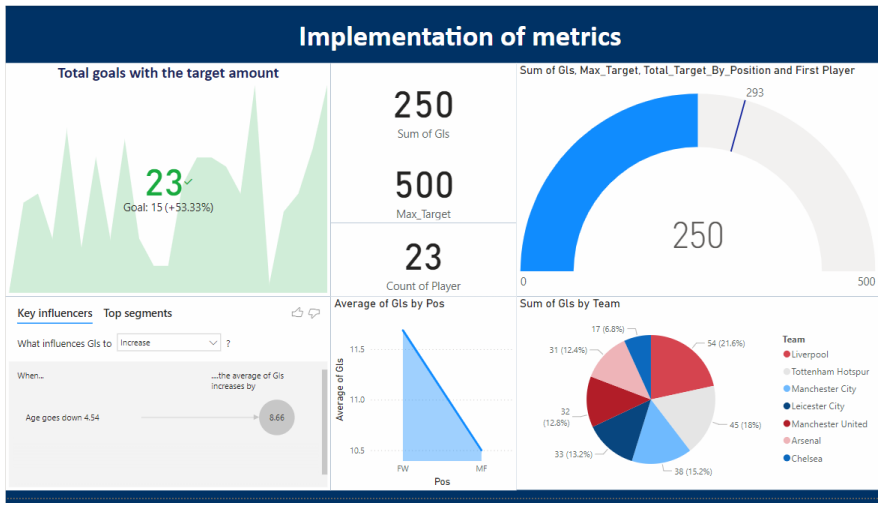

# Football Player Performance & KPI Dashboard

## 📌 Project Overview
This analytics project leverages Power BI to evaluate athletic performance metrics, target benchmarks, and key variables influencing goal-scoring trends across top-tier football teams. By utilizing advanced analytical visuals, the dashboard translates raw player statistics into actionable insights regarding team contributions and player profiles.

### 🛠️ Tech Stack & Key Concepts
* **Data Source:** `epl.csv` (Relational Football Statistics Dataset)
* **Tool:** Power BI Desktop
* **Core Techniques:** KPI Tracking, Machine Learning-Driven Data Insights (Key Influencers), Metric Segmentation, Performance Buffering.

---

## 📊 Dashboard Visuals

---

## 🔍 Dashboard Architecture & Metric Implementation

The dashboard is structured around a centralized layout focusing on performance tracking and driver identification:

*   **KPI & Gauge Chart (Goal Optimization):** Features a dedicated KPI visual showing total goals scored (**23**) against a set goal target of **15**, indicating a **+53.33% overachievement**. A parallel gauge chart monitors the cumulative league goals (**250**) against an overall maximum target parameter of **500**, built with a buffer to evaluate future growth.
*   **Key Influencers (Predictive Drivers):** Utilizes Power BI's built-in AI visual to identify primary factors that cause goal counts to rise. The model mathematically identifies that a **4.54-year decrease in player age increases the average goals by 8.66**.
*   **Positional Analysis:** A structured bar chart comparing the performance variance between Forwards (FW) and Midfielders (MF), tracking the baseline impact that field positioning has on scoring volume.
*   **Team Contribution Volume:** A pie chart breaking down the macro-level goal contributions across the league, highlighting top organizational performance.

---

## 💡 Core Performance Insights Derived

1. **Age-Performance Correlation:** The data reveals a clear inverse relationship between age and goal-scoring output; younger players demonstrate a significantly higher likelihood of inflating overall goal metrics.
2. **Positional Variance:** As expected, Forwards (FW) maintain a higher average goal profile than Midfielders (MF), verifying that field roles act as a major structural driver of performance variance.
3. **Organizational Leaders:** **Liverpool (54 goals)** and **Manchester City (45 goals)** stand out as the dominant scoring powers in this dataset, contributing the highest share of offensive output across the league.

---

## 📂 Repository Structure
